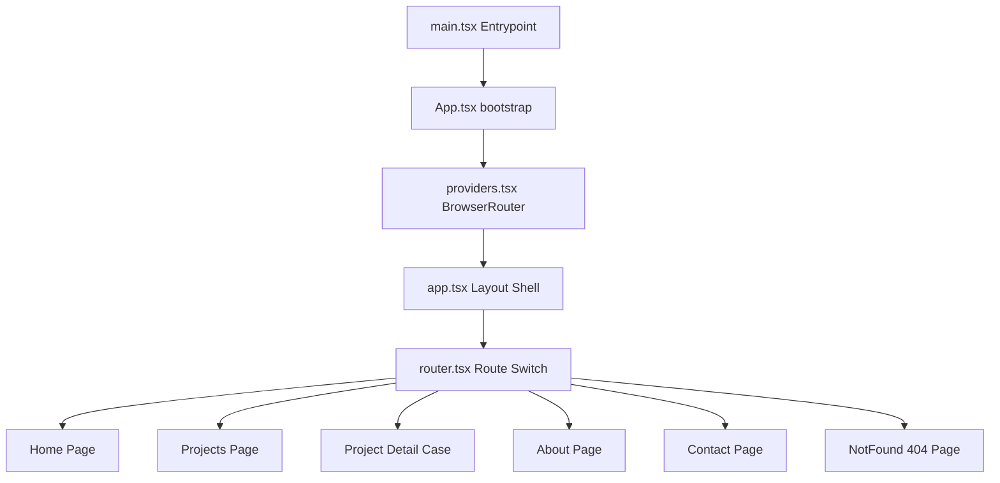

# Arquitetura do Projeto — caduazeredo.com

Este documento detalha as decisões de engenharia, estrutura de pastas e fluxos da V1 da aplicação.

## Fluxo Geral e Roteamento

A aplicação está configurada como uma **Single Page Application (SPA)** usando `react-router-dom` (v7).



O layout principal em `src/app/app.tsx` injeta o menu de navegação (`Navbar`), o rodapé (`Footer`) e a animação do fundo com grade (`SpaceBackground`). As páginas são injetadas no meio e animadas com transições de fade por meio do `PageShell` do Framer Motion.

## Estrutura de Arquivos

A divisão de pastas separa preocupações de forma limpa:
- `src/app/`: Arquivos globais de inicialização, provedores do roteador e roteador em si.
- `src/components/`: Subdividido por responsabilidade física:
  - `background/`: Estilização e grades visuais de fundo.
  - `layout/`: Componentes estruturais e transições de páginas.
  - `project/`: Representações de projetos, cards e badges de status.
  - `terminal/`: Janela de terminal do console e animações de texto.
  - `ui/`: Primitives como botões e utilitários universais.
- `src/content/`: Fonte de verdade de dados locais tipados (`projects.ts` e `contacts.ts`).
- `src/lib/`: Funções utilitárias como junção de classes com Tailwind v4 (`utils.ts`) e configurações de transição com Framer Motion (`motion.ts`).
- `src/pages/`: Ponto de entrada de rotas e visualizações completas.
- `src/styles/`: Centralização do Design System em `tokens.css` e resets em `globals.css`.

## Estratégia de Dados e Honestidade

Todos os dados da V1 são locais e estáticos. A tipagem estrita garante que dados ausentes (como links ou imagens não criadas) sejam tratados como opcionais e não quebrem o layout ou simulem links quebrados.

### Exemplo de Carregamento de Projetos
Os estudos de caso leem as informações de `src/content/projects.ts` filtrando pelo `slug` obtido nos parâmetros da URL:
```typescript
const { slug } = useParams<{ slug: string }>();
const project = projects.find(p => p.slug === slug);
```
Caso o slug não exista no array estático de projetos reais, a aplicação imediatamente redireciona o usuário para a rota de erro 404 (`/404`) de forma limpa.
