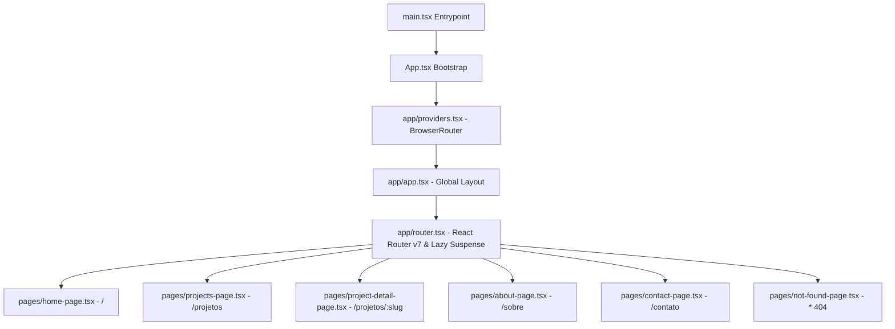

# Graphify — Grafo de Conhecimento do Codebase

Este arquivo contém o mapa topológico de símbolos, rotas, componentes e dependências do projeto `caduazeredo.com`, gerado para auditoria e navegação contextual por agentes de IA.

---

## 1. Topologia de Rotas e Páginas



---

## 2. Grafo de Componentes e Dependências

```mermaid
graph LR
    subgraph UI & Design Tokens
        Tokens[styles/tokens.css] --> Globals[styles/globals.css]
        Globals --> Utils[lib/utils.ts - cn()]
        Utils --> Button[components/ui/button.tsx - buttonVariants]
    end

    subgraph Background & Frame
        SpaceBg[components/background/space-background.tsx]
        Navbar[components/layout/navbar.tsx]
        Footer[components/layout/footer.tsx]
        PageShell[components/layout/page-shell.tsx - motion/react]
    end

    subgraph Terminal Componentry
        TermWin[components/terminal/terminal-window.tsx]
        Typewriter[components/terminal/typewriter-text.tsx]
    end

    subgraph Content & Project Components
        Types[types/index.ts - Project & ProjectStatus]
        DataProj[content/projects.ts]
        DataContacts[content/contacts.ts]
        StatusBadge[components/project/project-status.tsx]
        ProjCard[components/project/project-card.tsx]
    end

    Types --> DataProj
    StatusBadge --> ProjCard
    Types --> StatusBadge
```

---

## 3. Matriz de Mapeamento de Símbolos

| Módulo / Arquivo | Responsabilidade Principal | Símbolos Exportados | Dependências Chave |
| :--- | :--- | :--- | :--- |
| `src/types/index.ts` | Contrato de dados | `Project`, `ProjectStatus`, `ProjectCategory` | Nenhuma |
| `src/content/projects.ts` | Dados estáticos dos cases | `projects` | `src/types/index.ts` |
| `src/content/contacts.ts` | Dados de contato locais | `contactLinks`, `ContactLinks` | Nenhuma |
| `src/lib/utils.ts` | Helper para Tailwind v4 | `cn()` | `clsx`, `tailwind-merge` |
| `src/lib/motion.ts` | Variantes Framer Motion | `fadeInUp`, `fadeIn`, `staggerContainer` | `motion/react` |
| `src/components/ui/button.tsx` | Componente de botão & variantes | `Button`, `buttonVariants` | `@/lib/utils` |
| `src/components/terminal/terminal-window.tsx` | Moldura de terminal Linux | `TerminalWindow` | `@/lib/utils` |
| `src/components/terminal/typewriter-text.tsx` | Efeito typewriter acessível | `TypewriterText` | `prefers-reduced-motion`, `sr-only` |
| `src/components/project/project-status.tsx` | Badge de status do projeto | `ProjectStatus` | `@/types` |
| `src/components/project/project-card.tsx` | Card de projeto ou lab | `ProjectCard` | `@/types`, `ProjectStatus`, `lucide-react` |
| `src/components/background/space-background.tsx` | Fundo com grid e nebulosas | `SpaceBackground` | CSS Radial Gradients |

---

## 4. Auditoria de Qualidade do Grafo

- **Grau de Acoplamento**: Baixo. Todos os componentes UI consomem utilitários centralizados em `@/lib/utils` e tipos centralizados em `@/types`.
- **Roteamento SPA**: Otimizado com `React.lazy()` em `src/app/router.tsx` e reescritas de URL via `vercel.json`.
- **Pontos de Contribuição Futura (V2)**:
  - Adição de novos dados de projeto em `src/content/projects.ts`.
  - Expansão de rotas em `src/app/router.tsx`.
